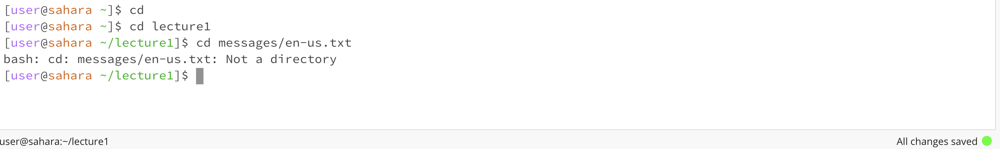
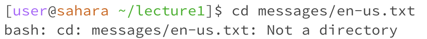
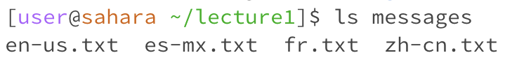
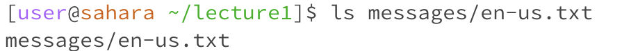
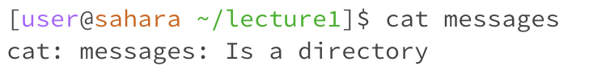

# Lab Report 1
1. **cd**  

* No arguments:

  

The working directory was /home when the command was run. There was no output printed when `cd ` was run because you did not provide a directory to change to, so nothing in the terminal changed. The The lack of output is not an error since you wouldn't expect there to be any changes when no arguments were input.  

* Path to a directory:

The working directory was /home when this command was run.  
The output was that the   was changed to 
The output is not an error because

* Path to a file:

The working directory was
The output was
The output is an error because you can't change the directory to a file

2. **ls**  

* No arguments:  
  
The working directory was
The output was
The output is an error  

   
* Path to a directory:
  
The working directory was
The output was
The output is an error  
  
 
* Path to a file:
 
The working directory was
The output was
The output is an error  

3. **cat**

* No arguments:
  
The working directory was /lecture1 when the command was run.  
The output looked blank because the terminal was waiting for user input. After you typed something and pressed enter, it would print what you typed,and you had to exit using `control c`.  
The output is not an error since entering `cat ` with no arguments, the terminal does not have a directory or file to refer to, and will not be able to output anything without further input from the user.  

   
* Path to a directory:
 
The working directory was
The output was
The output is an error  

   
* Path to a file:
 
The working directory was
The output was
The output is an error  
