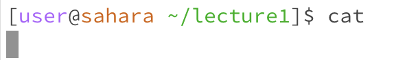

# Lab Report 1
1. **cd**  

* No arguments:

  
  

The working directory was /home when the command was run. There was no output when `cd ` was run because you did not provide a directory to change to, so nothing in the terminal changed and nothing was printed. The lack of output is not an error since you wouldn't expect there to be any changes when no arguments were input.  

* Path to a directory:

The working directory was /home when this command was run. The output was that the working directory was changed to /lecture1, which was indicated by the terminal displaying ~/lecture1 in the next line. The output is not an error because the working directory was successfully changed to the input, which was /lecture1, so the `cd ` command worked as intended.  

* Path to a file:

The working directory was /lecture1 when the command was run. The output message reflects that the terminal tried to change the directory to the input, which was a file, and that it was unsuccessful, since nothing should be printed when the directory is correctly changed. This output is an error because the directory cannot be set to a file, so the command was not executed.  

2. **ls**  

* No arguments:  

The working directory was \lecture1 when the command was run. The output printed out the contents of the \lecture1 folder, since that was the current directory and no input was given. This output was not an error, since all the files in the working directory were printed successfully, and command was executed as expected. 

   
* Path to a directory:  

The working directory was \lecture1 when the command was run. The output printed out the contents of the input directory , which was the \messages folder. This output is not an error, since every file in the \messages folder was correctly printed as expected when the `ls ` command was run with the \messages folder as input.
  
 
* Path to a file:
 
The working directory was \lecture1 when the command was run. The output printed out the path of the input file,
The output is not an error, since the command returned what was expected.  

3. **cat**  

* No arguments:
  

The working directory was /lecture1 when the command was run.  The output looked blank because the terminal was waiting for user input. After you typed something and pressed enter, it would print what you typed,and you had to exit using `control c`.  The output is not an error since entering `cat ` with no arguments does not give the terminal a directory or file to refer to, and thus nothing can be output without further input from the user.  

   
* Path to a directory:
 
The working directory was
The output was
The output is an error  

   
* Path to a file:
 
The working directory was
The output was
The output is an error  
