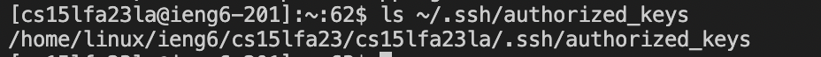
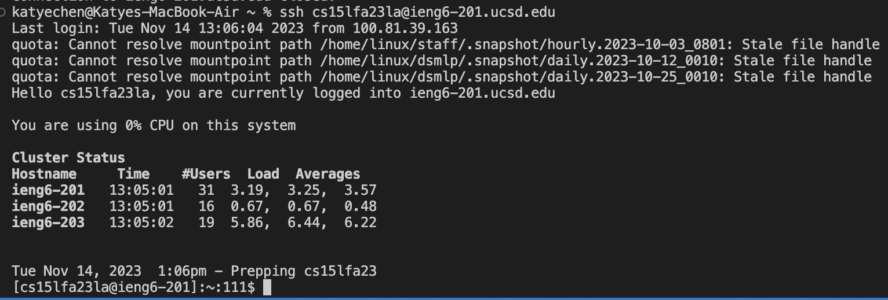

# Part 1 
```
import java.io.IOException;
import java.net.URI;

class Handler implements URLHandler {
    int numObjects = 1;
    String contents = "";

    public String handleRequest(URI url) {
        if (url.getPath().equals("/")) {
            return contents;
        }
        else {
            if (url.getPath().contains("/add-message")) {
                String[] parameters = url.getQuery().split("=");
                if (parameters[0].equals("s")) {
                    contents = contents + String.valueOf(numObjects) + ". " + parameters[1] + "\n";
                    numObjects++;
                    return contents;
                }
            }
        }
        return "404 Not Found!";
     }
}

class StringServer {
    public static void main(String[] args) throws IOException {
        if(args.length == 0){
            System.out.println("Missing port number! Try any number between 1024 to 49151");
            return;
        }

        int port = Integer.parseInt(args[0]);

        Server.start(port, new Handler());
    }
}
```
  
- The method handleRequest is called, with the url of the page being passed in as an URI argument. The relevant argument to handleRequest is the URI argument, which is `http://localhost:4029/add-message?s=Hi`. The relevant fields in the Handler class are `int` numObjects, which is initially equal to 1, and `String` contents, which is initially empty. As the method runs, since the value for URI url being passed in to handleRequest is `http://localhost:4029/add-message?s=Hi`, `url.getPath()` returns "/add-message". This means that the `else` condition runs. Since the path contains "/add-message", the value of `String[]` parameters is set to the query split at "=". `url.getQuery()` returns "s=Hi", so splitting at "=" means that "s" and "Hi" will become the elements of `String []` parameters. `String []` parameters is now equal to `[s, Hi]`. Next, since `parameters[0]` is "s", `String` contents is updated to include the value of `numObjects` as a string, which is currently 1, a period, `parameters[1]`, which is "Hi", and a newline character. Now `String` contents is equal to "1. Hi\n". In the next line, the value of `int` numObjects is incremented by 1, so it becomes equal to 2. At the end of this call to handleRequest, the relevant fields have been updated so `int` numObjects now equals 2, and `String` contents now equals "1. Hi\n".

  
- The method handleRequest is called, with the url of the page being passed in as an URI argument. The relevant argument to handleRequest is the URI argument, which is `http://localhost:4029/add-message?s=How%20are%20you`. The relevant fields in the Handler class are `int` numObjects, which is equal to 2 after the previous run of handleRequest, and `String` contents, which is equal to "1. Hi\n" after the previous call to handleRequest. As the method runs, since the value for `URI` url being passed in to handleRequest is `http://localhost:4029/add-message?s=How%20are%20you`, `url.getPath()` returns "/add-message". This means that the `else` condition runs. Since the path contains "/add-message", the value of `String[]` parameters is set to the query split at "=". `url.getQuery()` returns "s=How%20are%20you", so splitting at "=" means that "s" and "How%20are%20you" will become the elements of `String []` parameters. `String []` parameters is now equal to `[s, How%20are%20you]`. Next, since `parameters[0]` is "s", `String` contents is appended with the value of `numObjects` as a string, which is currently 2, a period, `parameters[1]`, which is "How%20are%20you", and a newline character. Now `String` contents is equal to "1. Hi\n2. How are you\n". In the next line, the value of `int` numObjects is incremented by 1, so it becomes equal to 3. At the end of this call to handleRequest, the relevant fields have been updated so `int` numObjects now equals 3, and `String` contents now equals "1. Hi\n2. How are you\n".

# Part 2
  

Running `ls ~/.ssh/id_rsa` on my computer (with the home directory as my working directory) returned the path to the private key for my SSH key, which is `/Users/katyechen/.ssh/id_rsa`.

   
  
After logging into my account on `ieng6`, running `ls ~/.ssh/authorized_keys` returned the path to the public key for my SSH key, which is `/home/linux/ieng6/cs15lfa23/cs15lfa23la/.ssh/authorized_keys`. This was created during lab when we created a directory called `.ssh`, then ran `scp` to copy the file from our personal computer to our account on `ieng6`, saving the copy under the name `authorized_keys`. The `authorized_keys` file is now inside the `.ssh` directory.  


  
  
I was able to log into `ieng6` without being prompted to enter my password, as after I entered the `ssh cs15lfa23la@ieng6.ucsd.edu` command, it immediately began the login steps without any additional input.

  

# Part 3 
In week 2 of lab, I learned how to connect to a remote server from my computer, which I had never done before. I also learned about running web servers, and accessing them from different computers. I did not know before that web servers used different port numbers, which let us all run a web server while being on the same `ieng6` computers. Accessing a remote server through VSCode this week was also new to me.
