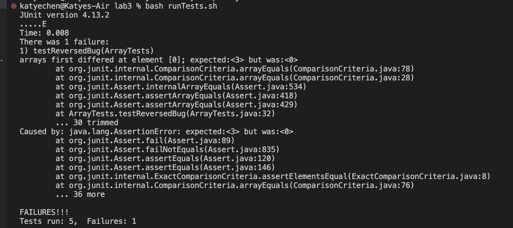

# Part 1 - Bugs  
- A failure-inducing input for the buggy program, as a JUnit test and any associated code (write it as a code block in Markdown)
This JUnit test results in a failure:
```
@Test
  public void testReversedBug() {
    int[] input1 = { 1, 2, 3 };
    assertArrayEquals(new int[]{ 3, 2, 1 }, ArrayExamples.reversed(input1));
  }
```
This is the code for the `reversed` method being tested:  
```
  static int[] reversed(int[] arr) {
    int[] newArray = new int[arr.length];
    for(int i = 0; i < arr.length; i += 1) {
      arr[i] = newArray[arr.length - i - 1];
    }
    return arr;
  }
```  
  
- An input that doesn’t induce a failure, as a JUnit test and any associated code (write it as a code block in Markdown)  
This JUnit test of the `reversed` method does NOT induce a failure:
```
  @Test
  public void testReversed() {
    int[] input1 = { };
    assertArrayEquals(new int[]{ }, ArrayExamples.reversed(input1));
  }
```
  
- The symptom, as the output of running the tests (provide it as a screenshot of running JUnit with at least the two inputs above)
This screenshot shows output of running these tests using the original `reversed` method code.  
  

(The code for the `runTests.sh` bash script is these two lines:) 
```
javac -cp .:lib/hamcrest-core-1.3.jar:lib/junit-4.13.2.jar ArrayTests.java

java -cp .:lib/hamcrest-core-1.3.jar:lib/junit-4.13.2.jar org.junit.runner.JUnitCore ArrayTests
```  
  
- The bug, as the before-and-after code change required to fix it (as two code blocks in Markdown)  
Before:
```
  static int[] reversed(int[] arr) {
    int[] newArray = new int[arr.length];
    for(int i = 0; i < arr.length; i += 1) {
      arr[i] = newArray[arr.length - i - 1];
    }
    return arr;
  }
```
After:
```   
  static int[] reversed(int[] arr) {
    int[] newArray = new int[arr.length];
    for(int i = 0; i < arr.length; i += 1) {
      newArray[i] = arr[arr.length - i - 1];
    }
    return newArray;
  }
```   

Orirginally, the elements of the input array, `arr`, were being assigned the values of the newArray, `arr`. But since the new array was never assigned any values, all the elements are just zero, so all the elements in the new array are just zero as well. Since the method is supposed to return a new array with the old array's elements in reversed order, this results in an error unless the array is empty, as is the case with the JUnit test that passes.  
To fix this, the elements of the NEW array needed to be assigned the elements of the input array, in reverse order. The method was also initially returning the input array, so the new array `newArray` needed be retunred instead. Changing the statement `arr[i] = newArray[arr.length - i - 1];` to `newArray[i] = arr[arr.length - i - 1];` and returning `newArray` rather than `arr` fixed the issues with this method.   


# Part 2 - Researching Commands 
I chose to find alternative ways to use `find`.  

1. `name -iname` (I found this option by using `man find` in the terminal)  
 Example 1:
  - Command:  
  ```
  find technical/government -iname "media"
  ```
  - Output:
  ```
  technical/government/Media
  ```  
  In this example, I used the `-iname` option for `find` to search the `government` directory of `./technical` for a file whose name contained the string `"media"`. The command returned a file named `"Media"`, so the `-iname` option found a match even though I entered the string with a lowercase m, and the file name had an uppercase M. `find -iname` found a match despite the different cases for m, which would be useful if you are unsure of exactly what the file's name is.  

  Example 2:
  - Command:  
  ```
  find technical/911report -iname "*.TXT"
```
  - Output:
  ```
  technical/911report/chapter-13.4.txt
  technical/911report/chapter-13.5.txt
  technical/911report/chapter-13.1.txt
  technical/911report/chapter-13.2.txt
  technical/911report/chapter-13.3.txt
  technical/911report/chapter-3.txt
  technical/911report/chapter-2.txt
  technical/911report/chapter-1.txt
  technical/911report/chapter-5.txt
  technical/911report/chapter-6.txt
  technical/911report/chapter-7.txt
  technical/911report/chapter-9.txt
  technical/911report/chapter-8.txt
  technical/911report/preface.txt
  technical/911report/chapter-12.txt
  technical/911report/chapter-10.txt
  technical/911report/chapter-11.txt
  ```  
  In this example, I used the `-iname` option for `find` to search the `911report` directory of `./technical` for a file whose name contains the string `".TXT"`. The command returned all the files in the directory whose names contained ".txt," so the `-iname` option was able to find all the appropriate files, even though I entered the string "TXT" in all caps, and the file names are all in lowercase. The `-iname` option could definitely be useful for doing searches when you are unfamiliar with the syntax of the file names you are searching.  
   
2. `find -path` (I found this option by using `man find` in the terminal)  
Example 1:  
  - Command:  
  ```
  find technical -path "technical/plos/pmed.002027*"
  ```  
  - Output:  
  ```
  technical/plos/pmed.0020273.txt
  technical/plos/pmed.0020272.txt
  technical/plos/pmed.0020275.txt
  technical/plos/pmed.0020274.txt
  technical/plos/pmed.0020278.txt
  ```  
  In this example, I used the `-path` option to search for files in the `technical/plos` directory that followed the pattern `pmed.002027`, and it output all files whose name matched the given pattern. This could be helpful when searching for files whose names match a specific pattern or contain a certain string.

 Example 2:
  - Command:   
  ```
  find technical -path "technical/911report/*8*"
  ```  
  - Output:  
  ```
  technical/911report/chapter-8.txt
  ```    
  In this example, I used the `-path` option to search for files in the `technical/911report` directory that contained an "8" as specified in the pattern, and it output all files whose name contained an "8". This option could be helpful if you are searching for a file that you know contains a specific string, but you are unsure of where in the name the string is, as you could use a pattern search like in this example.  

3. `find -maxdepth` (I found this option using `man find` in the terminal)  
 Example 1:  
  - Command:  
  ```
  find ./technical/government  -maxdepth 2  -name "Abuse*"
  ```   
  - Output:   
  ```
  ./technical/government/Media/Abuse_penalties.txt
  ```
  In this example, I used the `-maxdepth` option to specify that the `find` command should only search at most 2 directory levels below the `./technical/government` directory for files whose names contained the string "Abuse". This returned a file within the `Media` subdirectory, which is within the `government` directory, so this command could be useful when you want to explicitly search only certain levels of a filesystem.  

  Example 2:  
  - Command:  
  ```  
  find ./technical/government  -maxdepth 1  -name "A*"
  ```  
  - Output:  
  ```
  ./technical/government/About_LSC
  ./technical/government/Alcohol_Problems
  ```
  In this example, I used the `-maxdepth` option to specify that the `find` command should only search at most 1 directory levels below the `./technical/government` directory for files whose names matched the pattern of starting with a capital A. This returned the matching files within the `government` directory, without searching any of the subdirectories within `government`, so this command could be useful when you want to search within a directory without also searching its subdirectories.  
   
4. `find -s` (I found this option by using `man find` in the terminal)  
 Example 1:  
  - Command:  
  ```
  find -s technical/government/Media -name  "*Law*" 
  ```  
  - Output:  
  ```
  technical/government/Media/AP_LawSchoolDebts.txt
  technical/government/Media/Law-school_grads.txt
  technical/government/Media/Law_Award_from_College.txt
  technical/government/Media/Law_Schools.txt
  technical/government/Media/Lawyer_Web_Survey.txt
  technical/government/Media/Library_Lawyers.txt
  technical/government/Media/Philly_Lawyers.txt
  technical/government/Media/Poverty_Lawyers.txt
  technical/government/Media/Texas_Lawyer.txt
  ```  
  In this example, I used the `-s` option to specify that the `find` commmand should search the `technical/government/Media` directory in alphabetical order for file names that contain the string "Law". This command returned all matching file names within the `Media` subdirectory in alphabetical order, so the `-s` option could be useful if you want the directory to be traversed, and the results to be returned, in alphatbetical order.

  Example 2:  
  - Command:  
  ```
  find -s technical/government -maxdepth 1
  ```   
  - Output:
  ```
  technical/government
  technical/government/About_LSC
  technical/government/Alcohol_Problems
  technical/government/Env_Prot_Agen
  technical/government/Gen_Account_Office
  technical/government/Media
  technical/government/Post_Rate_Comm
  ```  
  In this example, I used the `-s-` and the `-maxdepth` option to search the `technical/government` directory in alphabetical order, and only without searching any of the subdirectories inside the `government` directory. This command returned all the files/directories within the `government` directory in alphabetical order, so this command could be useful as it can help avoid the need to sort your `find` results alphabetically after you've already run the command.
