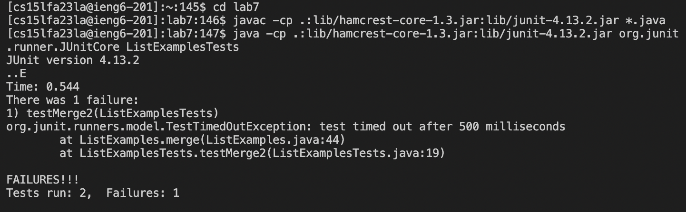

# Lab Report 4 -- Vim (Week 7)  

Here are all the steps and the commands I used to get to the steps:  

**Log into ieng6** 
  
Keys pressed: `<up><enter>`  
The command `ssh cs15lfa23la@ieng6-201.ucsd.edu` was the last command I ran in my history, so I used the up arrow to access it. This logged me into my ieng6 account.   

**Clone your fork of the repository from your Github account (using the SSH URL)**  
  
Keys pressed: `git clone <ctrl>v <enter>`  
I cloned the fork of the repository from my Github account by typing `git clone`, and pasting the `SSH` URL I copied from my Github page, git@github.com:ktychn/lab7.git. I pressed `<enter>` to run the command.   

**Run the tests, demonstrating that they fail**
  
Keys pressed: `cd lab7`, `javac -cp .:lib/hamcrest-core-1.3.jar:lib/junit-4.13.2.jar *.java`, `java -cp .:lib/hamcrest-core-1.3.jar:lib/junit-4.13.2.jar org.junit.runner.JUnitCore ListExamplesTests.java`  
To access the correct files, I first used the `cd` command to switch to the `lab7` directory. This changed my working directory so I could access the files in the `lab7` directory. Then I copied and pasted the `javac -cp .:lib/hamcrest-core-1.3.jar:lib/junit-4.13.2.jar *.java` and `java -cp .:lib/hamcrest-core-1.3.jar:lib/junit-4.13.2.jar org.junit.runner.JUnitCore ListExamplesTests.java` commands from the lab instructions to first compile all the .java files, and then run the file containing the tests, ListExamplesTests.java. The output of these JUnit tests appeared in the terminal after I ran them.  

**Edit the code file to fix the failing test**
  
Keys pressed: `vim ListExamples.java`, `<enter>`, `<shift> G`, `6`, `k`, `w`, `e`, `r`, `2`, `:wq`, `<enter`  
To edit the file, I used `vim` and provided the name of the file to be edited, `ListExamples.java`, then pressed `<enter>` to run the command. This opened the `vim` editor. I pressed `<shift> G` to use the capital G `vim` command, which brought me to the bottom of the file. Then, I pressed the `6` key, and the `k` key to navigate up 6 lines from the bottom. This brought me to the line that contained the error. I then pressed the `w` key, then the `e` key, which navigated me to the end of the first word in the line, which was "index1". Since I was hovering over the character that needed to be changed, 1, I pressed the `r` key to replace the current character without entering Insert mode. I pressed the `2` key to replace the incorrect character, then pressed the `:`, `w`, and `q` keys, followed by the `<enter>` key to save my changes and exit the `vim` editor. This brought me back to the terminal screen, having saved the change I made to the ListExamples.java code.  

**Run the tests, demonstrating that they now succeed**
  
Keys pressed: `<up><up><up><enter>`, `<up><up><up><enter>`  
Since the `javac -cp .:lib/hamcrest-core-1.3.jar:lib/junit-4.13.2.jar *.java` command was three up in my history, I pressed the `<up>` key three times to access it, then pressed `<enter>` to run it. This compiled all the java files in the `lab7` directory. After running that command, the `java -cp .:lib/hamcrest-core-1.3.jar:lib/junit-4.13.2.jar org.junit.runner.JUnitCore ListExamplesTests` command was three up in my history, so again, I pressed the `<up>` key three times to access it, then pressed `<enter>` to run it. This ran the JUnit tests in ListExamplesTests.java, and output the results of the tests to the terminal. The tests succeeded after changing the error in ListExamples.java.  

**Commit and push the resulting change to your Github account (you can pick any commit message!)**
  
Keys pressed: `git add ListExamples.java <enter>`, `git commit -m "updated ListExamples.java <enter>`, `git push <enter>`  
To add the modified file to the commit, I ran `git add` with the name of the file, ListExamples.java, then pressed `<enter>`. This added the updated ListExamples.java file to the commit. I then ran `git commit` with the `-m` option, and wrote a commit message describing what I changed to go with the commit. The terminal displayed output messages that described what was committed. Lastly, I ran `git push` to push the changes to Github. The terminal displayed output messages that described what was pushed, and the updated file was pushed to Github.  
