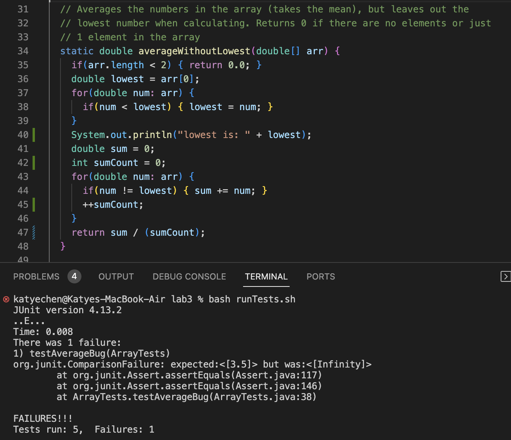
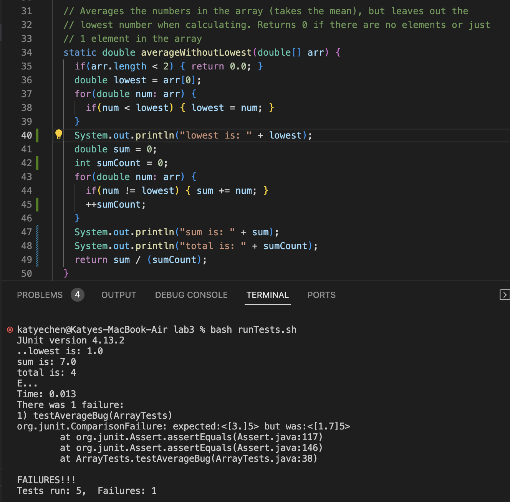

# Lab Report 5  
## Part 1 -- Debugging Scenario  
1. Original post:  
Hello, I am trying to test my ArrayExamples methods from Lab 3 and am running into an error for one of my tests. In my screenshot, you can see that my test for the averageWithoutLowest method is failing, since the output does not match what is expected. I am not sure what the issue with my method is, since it should be keeping track of which number is lowest, and taking the average of numbers with the lowest number excluded. My guess is that there is something wrong with a loop in my method, either the loop that finds the lowest number, or the loop that calculates the sum with the lowest number excluded. I would appreciate any help finding the issue with my code. Thank you!  
  

3. TA Response:  
Perhaps try adding print statements to check that the values you are using in the final calculation are correct. For example, adding a line with `System.out.println("total = " + sumCount)` before you return the final value could help you make sure the loop is behaving as expected.

4. Student follow-up:
I added some print lines to check the values of the `lowest`, `sum`, and `sumCount` variables after the loops like you suggested, and I see now that the `sumCount` did not have the right value. I see that I was incrementing the `sumCount` variable every iteration of the loop, including when the lowest number was identified, so I was dividing by the wrong value in the final calculation. I wanted to find the average excluding the lowest number, but I was dividing by the total number of elements, rather than the number of elements with the lowest number excluded. I changed my code so that `sumCount` was incremented within the if statement, so the total number of elements would exclude the lowest value. Thanks for the suggestion!  
  

5. Setup:

The files involved were ArrayTests.java and ArrayExamples.java, and the tests were being run using the runTests.sh bash script. All of these files were contained within the lab3 directory.

Before fixing the bug, this was the content of the files:  
- runTests.sh

```
javac -cp .:lib/hamcrest-core-1.3.jar:lib/junit-4.13.2.jar ArrayTests.java

java -cp .:lib/hamcrest-core-1.3.jar:lib/junit-4.13.2.jar org.junit.runner.JUnitCore ArrayTests
```  

 
- ArrayTests.java

```
import static org.junit.Assert.*;

import java.util.Arrays;

import org.junit.*;

public class ArrayTests {
	@Test 
	public void testReverseInPlace() {
    int[] input1 = { 3 };
    ArrayExamples.reverseInPlace(input1);
    assertArrayEquals(new int[]{ 3 }, input1);
	}

  @Test
  public void testReversed() {
    int[] input1 = { };
    assertArrayEquals(new int[]{ }, ArrayExamples.reversed(input1));
  }
  
  @Test 
	public void testReverseInPlaceBug() {
    int[] input1 = { 1, 2, 3, 4 };
    ArrayExamples.reverseInPlace(input1);
    assertArrayEquals(new int[]{ 4, 3, 2, 1 }, input1);
	}

   @Test
  public void testReversedBug() {
    int[] input1 = { 1, 2, 3 };
    assertArrayEquals(new int[]{ 3, 2, 1 }, ArrayExamples.reversed(input1));
  }

  @Test 
  public void testAverageBug() {
    double[] input1 = {1.0, 1.0, 3.0, 4.0};
    assertEquals("3.5", ""+ArrayExamples.averageWithoutLowest(input1));
  }
}
```  


- ArrayExamples.java
  
```
import java.util.Arrays;

public class ArrayExamples {

  // Changes the input array to be in reversed order
  static void reverseInPlace(int[] arr) {
    int[] original = arr.clone();
    for(int i = 0; i < arr.length; i += 1) {
      arr[i] = original[arr.length - i - 1];
    }
  }

  // Returns a *new* array with all the elements of the input array in reversed
  // order
  static int[] reversed(int[] arr) {
    int[] newArray = new int[arr.length];
    for(int i = 0; i < arr.length; i += 1) {
      newArray[i] = arr[arr.length - i - 1];
    }
    return newArray;
  }

  // Averages the numbers in the array (takes the mean), but leaves out the
  // lowest number when calculating. Returns 0 if there are no elements or just
  // 1 element in the array
  static double averageWithoutLowest(double[] arr) {
    if(arr.length < 2) { return 0.0; }
    double lowest = arr[0];
    for(double num: arr) {
      if(num < lowest) { lowest = num; }
    }
    System.out.println("lowest is: " + lowest);
    double sum = 0;
    int sumCount = 0;
    for(double num: arr) {
      if(num != lowest) { sum += num; }
      ++sumCount;
    }
    return sum / (sumCount);
  }
```  

To trigger the bug, I used the command `bash runTests.sh`, which executed the bash script. The bug was the result of an error in the ArrayExamples.java code, and the symptom was the testAverageBug JUnit test in the ArrayTests.java file failing.  

To fix the bug, the `++sumCount;` line had to be moved from outside the if statement condition to inside it, so that the `sumCount` variable is incremented only when the number is not the lowest. This gives the correct total value of elements, so the average is correctly calculated with the lowest value in the list excluded.  

## Part 2 -- Reflection  
In the second half of this quarter, I learned about how to use `vim` to edit text files from the command line. Before, I only knew how to open files in an editor like VSCode and edit them from there, but using `vim` to open and edit the file from the command line can really help speed up the process of editing a file. In addition, I learned that there are a ton of keyboard shortcuts you can use within `vim` that can speed up the navigation and editing process even more, such as `G` to move to the bottom of the file, `:set nu` to display line numbers, and `<ctrl> U` to delete an entire line. 
